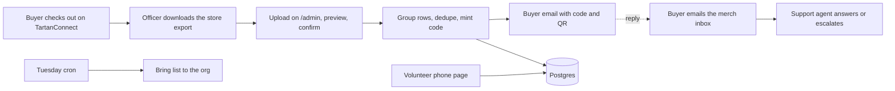

# sl-merch-operations

Merch logistics for ScottyLabs, Carnegie Mellon's student-run software organization.
This repository holds the assets and the automation behind the ScottyLabs Merch Store
on TartanConnect (CMU's CampusGroups instance): an at-cost store where every purchase
turns into a one-time pickup code, buyers collect at the weekly general body meeting
(GBM), and volunteers verify codes from a phone. The only human work is bringing shirts
to the GBM and tapping "Confirm handed over".

## What is in this repo

| Path | What it is |
|---|---|
| `service/` | The Merch Desk service: order intake, pickup codes, buyer emails, support agent, volunteer and admin pages. Python, FastAPI, SQLAlchemy, Postgres. Deployed on Sheltie, ScottyLabs' self-hosted Coolify. |
| `service/README.md` | Operator documentation for the service: flow, setup, deploy, runbook. |
| `assets/` | Product photography for the ScottyLabs Found T-Shirt (front, back, and a combined front-and-back image). |
| `.env.example` (in `service/`) | Every environment variable the service reads, with comments. |

Secrets never live in this repo. Real values go in a local `.env` (ignored by git) and in
the service's environment variables on Sheltie.

## Capabilities

**Store on TartanConnect.** One listing per size so inventory is tracked per size by
the platform itself. Each listing carries the product photo, a description with the
pickup policy, tax-included pricing so checkout shows a flat price, and a required
checkout question the buyer must answer to acknowledge in-person pickup. The store's
instructions banner and its receipt footer repeat the policy.

**Order intake from the store export.** TartanConnect has no API, so an officer
downloads the store's order export (Store → Sales → download CSV) and uploads it on the
admin page. The upload is previewed first: new checkouts, ones already known, refunds
to cancel, and rows that were skipped. Re-uploading the full history is the normal
workflow and is safe: each checkout is identified by buyer, timestamp and items, so
known orders are never duplicated and never emailed twice. Creating orders from emails
(the officer notification or a buyer-forwarded receipt) is off by default because a
forwarded receipt can be faked; `EMAIL_ORDER_INTAKE=1` turns it back on.

**Email parsing, when email intake is on.** The parser understands both TartanConnect
emails captured from a live order: the officer notification (buyer name, order number,
item rows, total, timestamp, but no buyer email) and the buyer receipt (the same table
plus the buyer's address in the footer). Unknown formats go through a generic parser,
then an LLM extraction via OpenRouter (strict JSON schema) that is validated against the email text,
then a review queue with an alert to the org. Nothing is dropped silently.

**Pickup codes.** Each order gets a unique code such as `SL-7K3Q-9RT2`, drawn from an
alphabet without 0, O, 1, I, L, or U so it can be read aloud at a noisy table. The
buyer receives it by email with an inline QR image and the rules: pickup only at the
GBM, no shipping, a friend may present the code, each code works once.

**Buyer email resolution (email intake only).** The store export always carries the
buyer's email. Only the officer notification omits it, so with email intake on an order
can exist with a code and no address. The address is filled in by whichever
arrives first: the buyer forwards their receipt to the merch inbox (matched by order
number, code sent within a minute), an officer uploads the Sales report on the admin
page, or an officer types it in. Orders still awaiting an address can be handed over by
name at the table.

**Volunteer pickup page.** A phone page behind a shared passcode. Type or scan the code,
see the buyer and items, enter your name and the delegate's if any, confirm. A second
confirm on the same order is refused and shows who handed it over and when. Name and
email search covers buyers who lost the code.

**Support agent.** Every inbound email that is not a purchase or refund notification is
first read by Jev, Typesafe's decision model, in one call: is it automated, is it about
money, someone else's order, or a complaint, what is it asking for, how frustrated is the
sender. Money, complaints and other people's orders go straight to an officer; the three
fixed intents (lost code, delegate, can't make it) are answered from templates when the
sender has one live order; everything else goes to an LLM agent via OpenRouter
(`z-ai/glm-5.3-flash` on zero-data-retention providers by default) with a fixed knowledge
base and the sender's own orders. Every LLM-written reply is screened by Jev again before
it is sent: no promised refunds, no invented pickup logistics, no commitments. It answers lost-code, delegate, can't-make-it, order-status,
sizing, how-to-buy, and about-the-org questions. Guardrails are enforced in code: orders
are looked up only by the sender's address, a reply may never contain a code the sender
does not own, automated mail is never answered, at most one reply per thread per day and
three per thread total, and money, refunds, complaints, or low-confidence cases are
forwarded to the org with a summary.

**Refund handling.** A TartanConnect refund-request notification freezes the matching
pending orders so the table refuses the code until an officer decides.

**Admin page.** Live bring list by size, orders table with resend and status controls,
the store-export upload with preview, a manual order form, a manual inbox poll, and a
reprocess button per inbound email.

**Weekly bring list.** Every Tuesday morning the org gets an email with how many of each
size to bring and how many orders are waiting for a buyer email.

## How an order flows



## Getting started

Operator setup, deployment to Sheltie, Gmail forwarding, and the runbook are in
[`service/README.md`](service/README.md). The short version:

```bash
cd service
python3 -m pip install -r requirements.txt
python3 -m pytest -q
DISABLE_SCHEDULER=1 uvicorn app.main:app --reload
```

Tests run against SQLite with a fake mail client and the real TartanConnect fixtures
(anonymized) in `service/tests/fixtures/`.

## Status

Live since September 2026. The store is published and the pipeline was validated end to
end with a real order: notification forwarded within seconds, order created, code
emailed, support agent replying to the buyer's follow-up.

Known platform issue: credit card checkout on TartanConnect fails for every buyer with
"cart expired after 15 minutes" at the payment handoff. This is on the TartanConnect
and CashNet side and has been reported to CMU's Student Org Finance office. Until it is
resolved, officers can record cash sales in the store's seller mode, which triggers the
same notification and the same code flow.

## Security

* Webhook requests are signature verified. Unsigned requests are rejected in production.
* Only emails from configured trusted senders can create orders.
* Buyer replies are matched to orders by the email thread the service started.
* Model output is schema validated and cross-checked against the source text. The model
  never composes free text to a buyer without the guardrails above, and every LLM reply is
  screened by a second, calibrated model before it is sent.
* LLM calls go only to the configured OpenRouter providers and only to their
  zero-data-retention endpoints that do not train on prompts.
* Passcodes are compared in constant time and sessions are signed cookies.
* No card data ever reaches this service. Payment stays inside TartanConnect and CashNet.

## License and contact

Maintained by ScottyLabs. Questions: scottylabs@cmu.edu.
