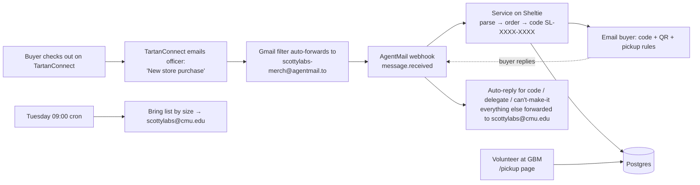

# ScottyLabs Merch Pickup Service

Turns every TartanConnect store purchase into a unique pickup code, emails it to
the buyer, and gives GBM volunteers a phone page to verify codes and record
handoffs. The only human work is bringing shirts to the GBM and tapping
"Confirm handed over".

## How it works



1. **Intake.** TartanConnect's officer notification "New store purchase" (email
   channel, enabled for the merch officer) lands in Gmail. A Gmail filter forwards
   it verbatim to the AgentMail inbox. AgentMail POSTs a `message.received`
   event to `/webhooks/agentmail` (Svix-signed).
2. **Parse.** `app/parser.py` knows both real TartanConnect templates (captured
   in `tests/fixtures/`): the officer notification ("<Buyer> successfully
   purchased from the store", order number, item rows, total, timestamp) and the
   buyer receipt (same table plus "This message is intended for <email>").
   The officer notification has **no buyer email**, so the order is created with
   its code in status `needs_email` and the address is filled in by whichever
   comes first: the buyer forwarding their receipt to the inbox (matched by
   order number, code sent within a minute), an officer uploading the Sales
   report on `/admin`, or an officer typing it on `/admin`. Unknown formats go
   through a generic regex parser, then an LLM via OpenRouter (strict JSON, validated
   against the text), then `needs_review` with an alert to the org.
3. **Order + code.** One `orders` row per checkout with a random 8-character
   code (alphabet without 0/O/1/I/L/U), unique in the DB. Duplicate
   notifications (Svix retries, double forwards) are recognized by event id,
   TartanConnect reference, and a buyer+items+minute hash.
4. **Buyer email.** Sent from `ScottyLabs Merch <scottylabs-merch@agentmail.to>`
   with the code in the subject, an inline QR, the item list, and the rules:
   pickup only at the weekly GBM, no shipping, a friend may present the code,
   each code works once.
5. **Pickup.** Volunteers open `/pickup` (shared passcode), type or scan the
   code, see the buyer and items, enter their own name (and the delegate's if
   any), tap confirm. A second confirm on the same order returns 409 with who
   handed it over and when. Name/email search covers buyers who lost the code.
6. **Replies.** Buyer replies thread back to the inbox. With an OpenRouter key the intent
   is classified into `code_request` / `delegate` / `cant_make_it` and answered
   from fixed templates (the model never free-writes to buyers); anything else,
   or no key, is forwarded to scottylabs@cmu.edu.
7. **Bring list.** Every Tuesday 09:00 (configurable) the org gets "bring N of
   each size" for all unpicked orders. `/admin` shows the same live.
8. **Reconcile.** Upload TartanConnect's Store → Sales → Generate Report CSV on
   `/admin`; any purchase the service never saw becomes an order and the buyer
   gets a code. This is the safety net if a notification is ever missed.

## Layout

```
service/
  app/
    main.py        FastAPI routes: webhook, /pickup, /admin, CSV, reconcile
    webhook.py     Svix verification, classification, purchase handling
    parser.py      deterministic + LLM extraction
    llm.py         the one structured-JSON model call (OpenRouter)
    orders.py      create order, send code email, record pickup, bring list
    responder.py   buyer reply intents + templated auto-replies
    agentmail.py   tiny REST client
    emails.py      all outbound copy
    codes.py       code format / normalization
    db.py          SQLAlchemy models (orders, order_items, pickups, inbound_emails)
    scheduler.py   APScheduler cron for the bring list
    templates/     login, pickup (phone UI w/ QR scanner), admin
  scripts/
    register_webhook.py   create the AgentMail webhook, prints the secret once
    simulate_purchase.py  send a synthetic purchase email into the inbox
  tests/           pytest: codes, parser, full webhook→pickup flow (SQLite)
  Dockerfile, .env.example
```

## Local run

```bash
cd service
python3 -m pip install -r requirements.txt
cp .env.example .env   # or rely on ../.env at the repo root
DISABLE_SCHEDULER=1 uvicorn app.main:app --reload
python3 -m pytest -q
```

Without `DATABASE_URL` it uses `./merch.db` (SQLite). Without
`AGENTMAIL_WEBHOOK_SECRET` the webhook accepts unsigned JSON, which is only
allowed on SQLite; production refuses to start processing without the secret.

## Deploy on Sheltie

Sheltie is ScottyLabs' Coolify instance (https://sheltie.scottylabs.org). The
service runs there as project **merch-operations** with a managed Postgres.

1. **Projects → merch-operations → production → + New Resource → Public Repository.**
   Repository `https://github.com/scottylabs-labrador/sl-merch-operations`, branch
   `main`, build pack **Dockerfile**, base directory `/service`, port `8000`,
   health check path `/health`.
2. **Environment variables**, from `.env.example`:

| variable | value |
|---|---|
| `AGENTMAIL_API_KEY` | the inbox-scoped key for the merch inbox |
| `AGENTMAIL_INBOX_ID` | `scottylabs-merch@agentmail.to` |
| `DATABASE_URL` | the Postgres resource's internal URL (copy from its page in Sheltie) |
| `PUBLIC_BASE_URL` | `https://merch.sheltie.scottylabs.org` |
| `VOLUNTEER_PASSCODE`, `ADMIN_PASSCODE`, `SESSION_SECRET` | long random strings |
| `OPENROUTER_API_KEY` | optional, enables parse fallback, reply intents, support desk |
| `LLM_MODEL` | `openai/gpt-6-astra` by default. Any OpenRouter model that supports structured outputs works; `anthropic/claude-sonnet-5` or `openai/gpt-5-mini` are cheaper |
| `TRUSTED_SENDERS` | platform sender plus the officer whose Gmail forwards |
| `GBM_INFO` | one sentence with day/time/room, shown in every buyer email |

3. **Deploy**, then register the webhook against the new URL and store its secret:

```bash
python3 scripts/register_webhook.py https://merch.sheltie.scottylabs.org/webhooks/agentmail
# prints AGENTMAIL_WEBHOOK_SECRET=whsec_... → add it as a variable on Sheltie, redeploy
```

Pushes to `main` redeploy automatically once the GitHub App is connected; until
then, use **Redeploy** in Sheltie or `coolify deploy` from the CLI.

## Gmail forwarding (one-time, done by the merch officer in Gmail's UI)

1. Gmail → Settings → Forwarding and POP/IMAP → Add a forwarding address →
   `scottylabs-merch@agentmail.to`. Gmail emails a confirmation code to that
   inbox; read it with
   `curl -H "Authorization: Bearer $AGENTMAIL_API_KEY" https://api.agentmail.to/v0/inboxes/scottylabs-merch%40agentmail.to/messages?limit=3`
   and paste the code back into Gmail.
2. Create a filter: `from:(tartanconnect@andrew.cmu.edu) subject:("store purchase")`
   → Forward to `scottylabs-merch@agentmail.to`. Keep "Never send to spam".
3. Buy one shirt yourself (or run `scripts/simulate_purchase.py` with the inbox
   temporarily in `TRUSTED_SENDERS`). Confirm `/admin` shows the order and the
   code email arrives. Then save the real notification's HTML as
   `tests/fixtures/new_store_purchase.html` and run pytest so the parser is
   locked to the real template.

Alternative that removes Gmail from the loop: TartanConnect allows guest
accounts without an Andrew ID. If a guest account with the AgentMail address
can be made a ScottyLabs officer, enable only its "New store purchase" email
notification and TartanConnect will email the inbox directly.

## Known platform issue (Sept 2026)

Credit card checkout on the store fails for every buyer: TartanConnect creates
a cart, redirects to `/scottylabs/rsvp_paypal?cart_id=...`, and that page
returns "Sorry but this cart expired after 15 minutes" immediately. The group's
Online Revenues ledger has never had a transaction, so the CashNet gateway
appears not to be active for ScottyLabs. A request to
StudentOrgFinance@andrew.cmu.edu is drafted in the scottylabs@cmu.edu mailbox.
Until it is fixed, officers can record cash sales in seller mode (Store →
seller view → quantity → Checkout → pick buyer → Paid by Cash), which fires the
same notification and therefore the same pickup-code flow.

## Runbook

* Volunteer can't find a code: search by name/email on `/pickup`. Orders still
  awaiting an email have a code too and can be handed over by name.
* Order shows "awaiting buyer email": buyer forwards their receipt to the inbox,
  or an officer fills the address on `/admin` (Store → Sales shows it), or
  uploads the Sales report CSV.
* Buyer never got the email: `/admin` → Resend code (check spam first; AgentMail
  sends from agentmail.to with SPF/DKIM/DMARC passing).
* Suspicious duplicate: `/admin` → set status `cancelled`; codes for cancelled
  orders are refused at pickup.
* Missed notification: `/admin` → upload the Sales report CSV.
* Rotate passcodes: change the variable on Sheltie and redeploy; existing cookies expire in 12h.
* New officer next year: they need Admin on Sheltie, the AgentMail account,
  and the Gmail filter moved to their account (or the guest-officer approach).

## Security notes

* Webhooks are Svix-signature verified; unsigned requests are rejected in production.
* Only emails from `TRUSTED_SENDERS` can create orders. Buyer replies are only
  matched by thread id to an email we sent.
* LLM output is schema-validated and cross-checked against the source text;
  the model never composes buyer-facing text.
* Passcodes compared in constant time; cookies are signed and `HttpOnly`.
* No card data ever touches this service; payment stays inside TartanConnect/CashNet.
